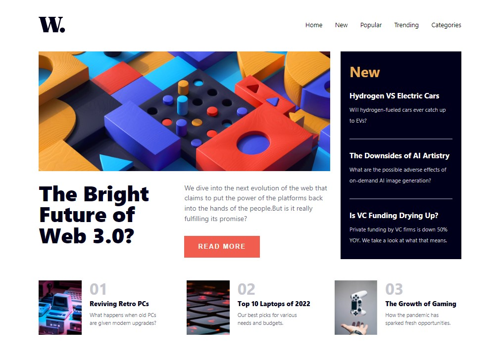

# Frontend Mentor - News homepage solution

This is a solution to the [News homepage challenge on Frontend Mentor](https://www.frontendmentor.io/challenges/news-homepage-H6SWTa1MFl). Frontend Mentor challenges help you improve your coding skills by building realistic projects. 

## Table of contents

- [Overview](#overview)
  - [The challenge](#the-challenge)
  - [Screenshot](#screenshot)
  - [Links](#links)
- [My process](#my-process)
  - [Built with](#built-with)
- [Author](#author)

## Overview

### The challenge

Users should be able to:

- View the optimal layout for the interface depending on their device's screen size
- See hover and focus states for all interactive elements on the page

### Screenshot

### Links

- Solution URL: [Loading](https://www.frontendmentor.io/solutions/a-responsive-news-homepage-using-react-and-scss-lhblpTrsq1)
- Live Site URL: [Visit](https://news-home-lexzee.vercel.app)

## My process

### Built with

- Semantic HTML5 markup
- Flexbox
- CSS Grid
- SCSS
- Mobile-first workflow
- [React](https://reactjs.org/) - JS library
- [Next.js](https://nextjs.org/) - React framework

## Author

- Website - [Abdulquddus Abdulrahman (Lexzee)](https://github.com/lexzee)
- Frontend Mentor - [@lexzee](https://www.frontendmentor.io/profile/lexzee)
- Twitter - [@devlexzee](https://www.twitter.com/devlexzee)

